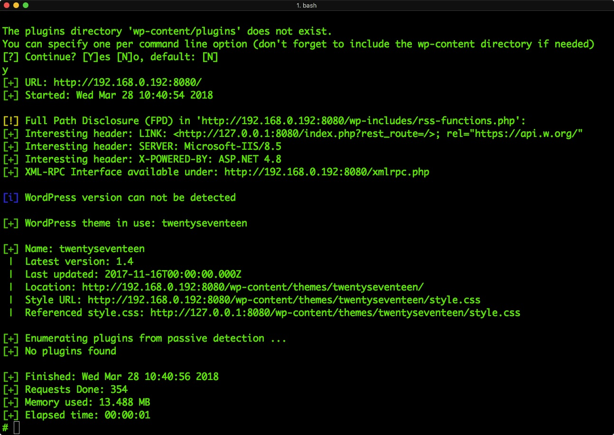
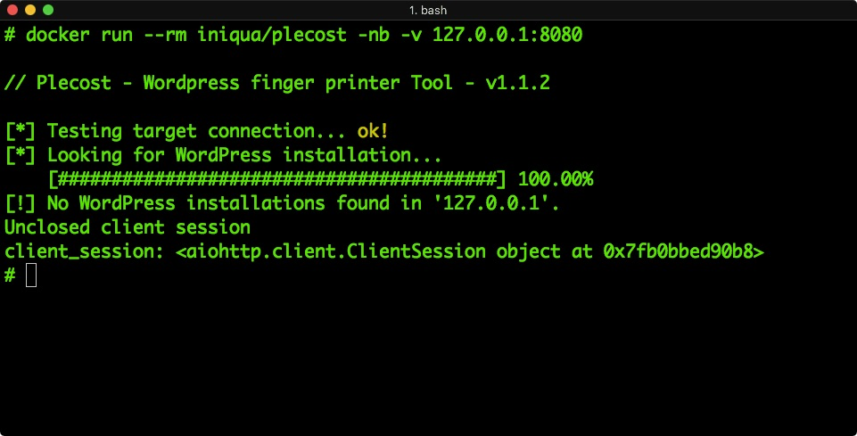
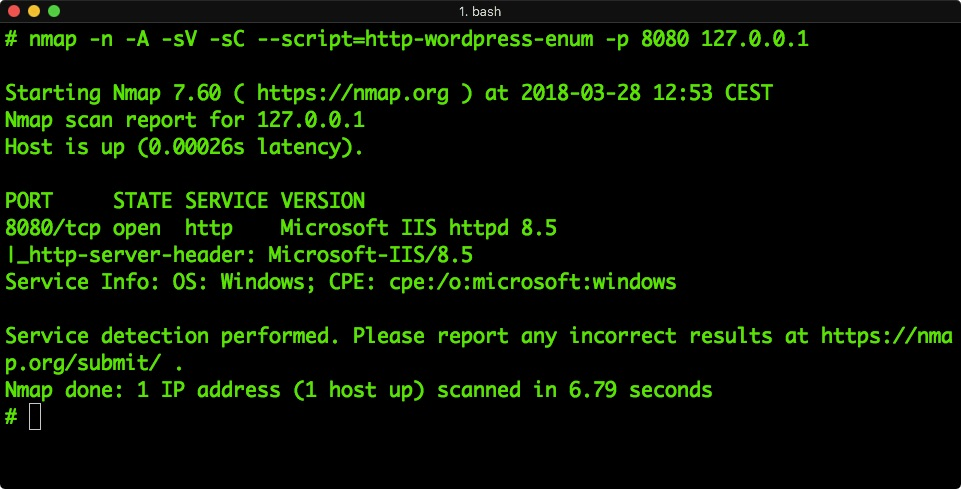

# Hardened deployment of Nginx for WordPress

This repo only add small rules in the nginx configuration for Wordpress, **without change any internal functionality** of Wordpress.

**The main goal is to disable hacking tools lik: WP-Scan or Plecost** 

# Security rules

- Denied access to the Readme, license or changelog files from plugins, to avoid extract plugins versions
- Denied access to .htaccess files
- Denied access to files starting at symbol: "~", usually backup files
- Denied public access to upload.php / file.php
- Denied public access to any .php file from a theme
- Denied public access to wp.config.php file  
- Denied public access error_log file  
- Limited internal-only access to *wp-content/* and *wp-includes/*

# Paranoid-rules

I recognize, I'm a bit paranoid. So, this repo also implement:

- Nginx will tell to the scanners that it's a "Microsoft-IIS/8.5" instead of nginx
- Nginx will change the typical HTTP header response, *X-Powered-By: PHP/7.5" to *X-Powered-By: ASP.NET 4.8"
  
  
# Examples

This docker image must be complemented with the *wordpress-docker-sec* image, that you can find at: https://github.com/cr0hn/wordpress-docker-sec

To quick test, you can download the *docker-compose.yml* form this repo and launch a complete hardened stack of Wordpress:

```yaml

version: "3"
services:

  wordpress:
    image: cr0hn/wordpress-docker-sec
    depends_on:
      - mysql
    environment:
      WORDPRESS_DB_PASSWORD: my-secret-pw
    volumes:
      - wordpress:/var/www/html

  nginx:
    image: cr0hn/nginx-wordpress-docker-sec
    depends_on:
     - wordpress
    volumes:
     - wordpress:/var/www/html/
    ports:
     - "8080:80"
    environment:
      POST_MAX_SIZE: 128m

  mysql:
    image: mysql:5.7
    environment:
      MYSQL_ROOT_PASSWORD: my-secret-pw
      MYSQL_DATABASE: wordpress


volumes:
  wordpress:
```

# Screenshots

If you deploy this version of configuration for Nginx + wordpress-docker-sec (see below) hacking tools will tell you something like:

## WP-Scan



## Plecost



## Nmap

